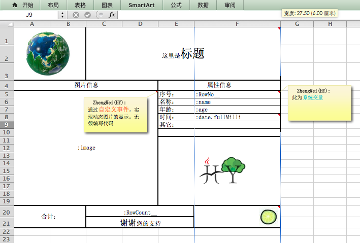
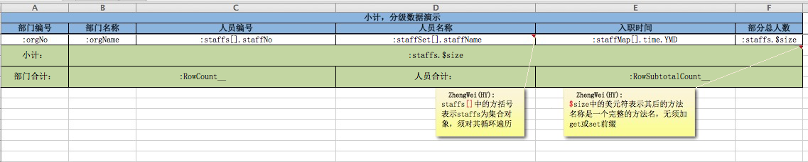
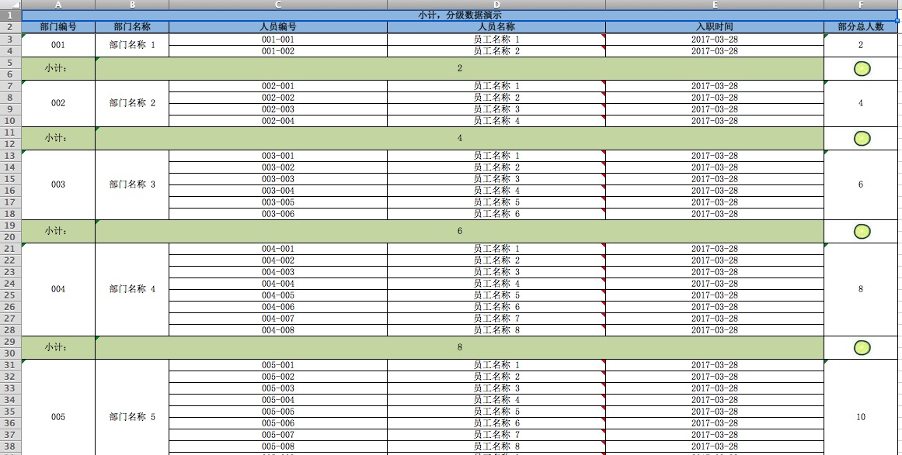
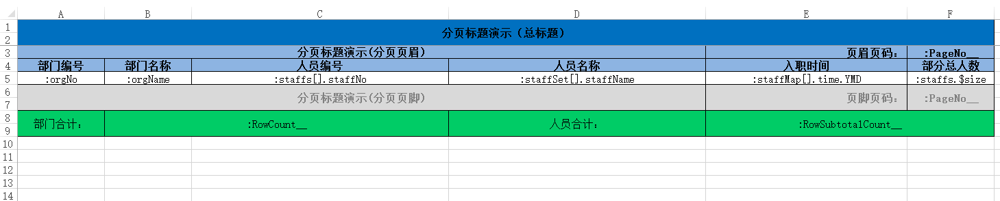
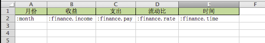
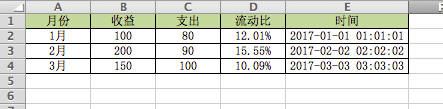
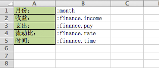
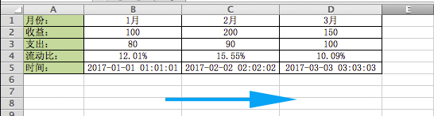

# hy.common.report
  


目录
------
* [主导思想](#主导思想)
* Java对象转Excel报表
	* [一行数据一页的模板举例](#一行数据一页的模板举例)
	* [动态行+小计的模板举例](#动态行和小计的模板举例)
	* [分页页眉、分页页脚的模板举例](#分页页眉和分页页脚的模板举例)
* Excel报表转Java对象
	* [常规的纵深扩展的模板举例](#Excel转为Java对象-常规的纵深扩展的模板举例)
	* [横向扩展的模板举例](#Excel转为Java对象-横向扩展的模板举例)


主导思想
------
	
	1. 由Excel模板文件 + XML配置文件即可定义一张报表。无须编写代码，实现快速、高效、简单的开发报表。

	2. 并且可以反向，将Excel文件数据转为Java对象。

基于Apache POI接口。实现对*.xls 、*.xlsx两种文件格式的操作。

可保证生成2003版本与2007版本的Excel格式是一样的。 


一行数据一页的模板举例
------




	1. 列宽问题：请将模板中的每一列的列宽均设置成整数(或合适的小数)，这将影响生成报表的列宽。(POI在换算单位时，除值后取整，可能造成列宽有差异)。
	
	2. 单元格颜色问题：在使用2003版本的模板时，单元格颜色最好设置为标准颜色，否则会出现颜色的失真。   
  
__一行数据一页的的生成结果__
  

  
  
  
__一行数据一页的XML配置__
```xml
<?xml version="1.0" encoding="UTF-8"?>

<config>

	<import name="xconfig"         class="java.util.ArrayList" />
	<import name="template"        class="org.hy.common.report.bean.RTemplate" />
	
	
	
	<!-- 报表模板配置信息 -->
	<xconfig>
	
		<template id="ReportTemplate">
			<name>模板名称</name>
			<excelFileName>classpath:JU_ExcelHelp.xls</excelFileName>   <!-- Excel模板文件所在地方。并通过扩展名识别文件格式类型 -->
			<titleBeginRow>0</titleBeginRow>                            <!-- 定义报表标题在模板中位置 -->
			<titleEndRow>0</titleEndRow>
			<dataBeginRow>1</dataBeginRow>                              <!-- 定义报表数据在模板中位置 -->           
			<dataEndRow>59</dataEndRow>
			<totalBeginRow>60</totalBeginRow>                           <!-- 定义报表合计在模板中位置 -->
			<totalEndRow>61</totalEndRow>
			<dataClass>org.hy.common.report.junit.ExcelBean</dataClass> <!-- 定义报表数据对应的Java类型 -->
			<valueSign>:</valueSign>                                    <!-- Excel模板中值的标记。默认为一个冒号。通过它识别要反射获取的值。支持 xx.yy.zz 格式 -->
			
			<call name="addListener">                                   <!-- 定义自定义变量名称的二次加工事件 -->
				<listener class="org.hy.common.report.event.ImageListener">
					<valueName>:image</valueName>                       <!-- 定义变量名称 -->
					<beginRow>29</beginRow>                             <!-- 定义动态图片在模板中的位置 -->
					<endRow>43</endRow>
					<beginColumn>0</beginColumn>
					<endColumn>8</endColumn>
				</listener>
			</call>
		</template>
		
	</xconfig>
	
</config>
```  
  
  
__一行数据一页报表生成及保存的Java代码举例__
```java
// 获取报表模板对象
RTemplate v_RTemplate = (RTemplate)XJava.getObject("ReportTemplate");
    
ExcelHelp.save(ReportHelp.toExcel("Excel工作表名称" ,数据集合 ,v_RTemplate).getWorkbook() ,"Excel报表保存目录及名称");
```  


动态行和小计的模板举例
------



	1. []：方括号表示前面的方法名称的返回类型是集合对象。目前支持List、Set、Map三种集合。并须对集合遍历动态生成数据。
	
	2. $：美元符表示其后的方法名称是一个完整的方法名称，无须加get或set前缀。

__动态行+小计报表的生成结果__




__动态行+小计报表的XML配置举例__
```xml
<?xml version="1.0" encoding="UTF-8"?>

<config>

	<import name="xconfig"         class="java.util.ArrayList" />
	<import name="template"        class="org.hy.common.report.bean.RTemplate" />
	
	
	
	<!-- 报表模板配置信息 -->
	<xconfig>
	
		<template id="ReportTotalSubtotal">
			<name>小计、分组数据的报表演示</name>
			<excelFileName>classpath:JU_Total_Subtotal.xlsx</excelFileName>
			<titleBeginRow>0</titleBeginRow>
			<titleEndRow>1</titleEndRow>
			<dataBeginRow>2</dataBeginRow>
			<dataEndRow>2</dataEndRow>
			<subtotalBeginRow>3</subtotalBeginRow>   <!-- 报表小计的开始行号（包括此行）。下标从零开始 -->
			<subtotalEndRow>4</subtotalEndRow>       <!-- 报表小计的结束行号（包括此行）。下标从零开始 -->
			<dataClass>org.hy.common.report.junit.total.OrgInfo</dataClass>
		</template>
		
	</xconfig>
	
</config>
```


分页页眉和分页页脚的模板举例
------



	1. []：方括号表示前面的方法名称的返回类型是集合对象。目前支持List、Set、Map三种集合。并须对集合遍历动态生成数据。
	
	2. $：美元符表示其后的方法名称是一个完整的方法名称，无须加get或set前缀。

__分页页眉、分页页脚的生成结果__


__分页页眉、分页页脚的XML配置举例__
```xml
<?xml version="1.0" encoding="UTF-8"?>

<config>

	<import name="xconfig"         class="java.util.ArrayList" />
	<import name="template"        class="org.hy.common.report.bean.RTemplate" />
	
	
	
	<!-- 报表模板配置信息 -->
	<xconfig>
	
		<template id="ReportPageTitle">
			<name>分页标题的报表演示</name>
			<excelFileName>classpath:JU_PageTitle.xlsx</excelFileName>
			
			<!-- 总标题 -->
			<titleBeginRow>0</titleBeginRow>
			<titleEndRow>1</titleEndRow>
			
			<perPageRowSize>20</perPageRowSize>
			
			<!-- 分页页眉标题 -->
			<titlePageHeaderBeginRow>2</titlePageHeaderBeginRow>
			<titlePageHeaderEndRow>3</titlePageHeaderEndRow>
			
			<!-- 数据内容 -->
			<dataBeginRow>4</dataBeginRow>
			<dataEndRow>4</dataEndRow>
			
			<!-- 分页页脚标题 -->
			<titlePageFooterBeginRow>5</titlePageFooterBeginRow>
			<titlePageFooterEndRow>6</titlePageFooterEndRow>
			
			<!-- 合计 -->
			<totalBeginRow>7</totalBeginRow>
			<totalEndRow>8</totalEndRow>
			
			<dataClass>org.hy.common.report.junit.total.OrgInfo</dataClass>
		</template>
		
	</xconfig>
	
</config>
```


Excel转为Java对象-常规的纵深扩展的模板举例
------
 


__Excel转为Java对象：常规的纵深扩展的数据举例__



__Excel转为Java对象：常规的纵深扩展的XML配置举例__
```xml
<?xml version="1.0" encoding="UTF-8"?>

<config>

	<import name="xconfig"         class="java.util.ArrayList" />
	<import name="template"        class="org.hy.common.report.bean.RTemplate" />
	
	
	
	<!-- 报表模板配置信息 -->
	<xconfig>
	
		<template id="ReadVertical">
			<name>Excel转Java纵深扩展数据的Excel文件</name>
			<excelFileName>classpath:JU_ReadVertical.xlsx</excelFileName>
			<dataBeginRow>1</dataBeginRow>
			<dataClass>org.hy.common.report.junit.readHorizontal.Finance</dataClass>
		</template>
		
	</xconfig>
	
</config>
```

__Excel转为Java对象：常规的纵深扩展的Java代码举例__
```java
// 获取报表模板对象
RTemplate    v_RTemplate = (RTemplate)XJava.getObject("ReadVertical");
List<Object> v_Datas     = ReportHelp.toJava(v_RTemplate ,"Excel数据文件的路径");

Help.print(v_Datas);
```


Excel转为Java对象：横向扩展的模板举例
------
 


__Excel转为Java对象：横向扩展的数据举例__



__Excel转为Java对象：横向扩展的XML配置举例__
```xml
<?xml version="1.0" encoding="UTF-8"?>

<config>

	<import name="xconfig"         class="java.util.ArrayList" />
	<import name="template"        class="org.hy.common.report.bean.RTemplate" />
	
	
	
	<!-- 报表模板配置信息 -->
	<xconfig>
	
		<template id="ReadHorizontal">
			<name>Excel转Java横向扩展数据的Excel文件</name>
			<excelFileName>classpath:JU_ReadHorizontal.xlsx</excelFileName>
			<direction>1</direction>        <!-- 方向：横向扩展 -->
			<dataBeginRow>0</dataBeginRow>
			<dataEndRow>4</dataEndRow>
			<dataBeginCol>1</dataBeginCol>
			<dataClass>org.hy.common.report.junit.readHorizontal.Finance</dataClass>
		</template>
		
	</xconfig>
	
</config>
```

__Excel转为Java对象：横向扩展的Java代码举例__
```java
// 获取报表模板对象
RTemplate    v_RTemplate = (RTemplate)XJava.getObject("ReadHorizontal");
List<Object> v_Datas     = ReportHelp.toJava(v_RTemplate ,"Excel数据文件的路径");

Help.print(v_Datas);
```


---
#### 十分感谢以下朋友支持与建议
  1. [邹德福](https://github.com/dirful)：建议使用简单的反射规则，如 :staffs[].staffName ，而非之前的 :staffs.$get(index).staffName 完整Java方法路径形式。
  
  2. [李　浩](https://github.com/343136848)：建议对动态数据及小计功能的支持。
   


---
#### 本项目引用Jar包，其源码链接如下
引用 https://github.com/HY-ZhengWei/hy.common.base 类库

引用 https://github.com/HY-ZhengWei/hy.common.file 类库

引用 https://github.com/HY-ZhengWei/XJava 类库
