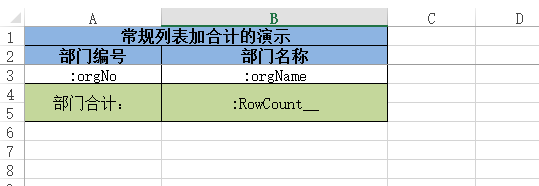
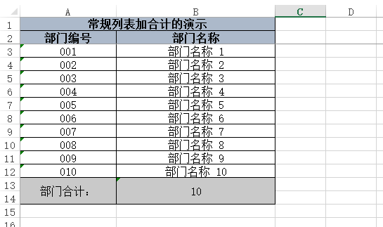
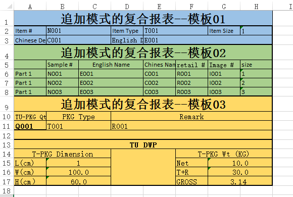
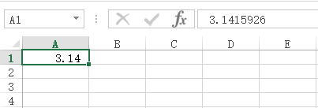
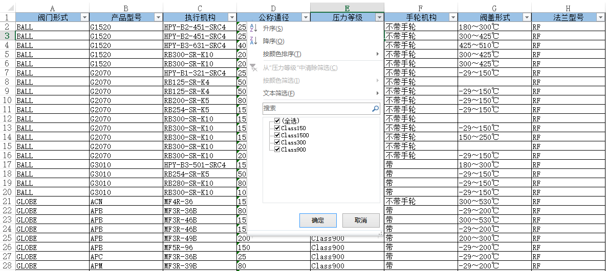

# hy.common.report
  


目录
------
* [主导思想](#主导思想)
* [概要说明](#概要说明)
* Java对象转Excel报表
    * [常规列表加合计的模板举例](#常规列表加合计的模板举例)
	* [一行数据一页的模板举例](#一行数据一页的模板举例)
	* [动态行和小计的模板举例](#动态行和小计的模板举例)
	* [分页页眉和分页页脚的模板举例](#分页页眉和分页页脚的模板举例)
	* [追加模式的复合报表举例](#追加模式的复合报表举例)
* Excel报表转Java对象
	* [常规的纵深扩展的模板举例](#常规的纵深扩展的模板举例)
	* [横向扩展的模板举例](#横向扩展的模板举例)
* 使用小技巧
	* [小数格式的处理](#小数格式的处理)
	* [添加高级筛选](#添加高级筛选)
	* [冻结标题](#冻结标题)
	* [自动行高](#自动行高)
	* [动态背景色](#动态背景色)
	* [二维码的生成（占位符监听器）](#二维码的生成)
	* [条形码的生成（占位符监听器）](#条形码的生成)
* [特别鸣谢](#特别鸣谢)


主导思想
------
	
	1. 由Excel模板文件 + XML配置文件即可定义一张报表。无须编写代码，实现快速、高效、简单的开发报表。

	2. 并且可以反向，将Excel文件数据转为Java对象。


概要说明
------

基于Apache POI接口。实现对*.xls 、*.xlsx两种文件格式的操作。

可保证生成2003版本与2007版本的Excel格式是一样的。 


__Excel模板文件中定义变量名称__，格式为 ":xx.yy.zz" ，通过反射生成报表数据。格式中的冒号 ":" 可通过模板XML配置定义更换。

	1. :xx.yy[].zz   方括号表示前面的方法名称的返回类型是集合对象。目前支持List、Set、Map三种集合。并须对集合遍历动态生成数据。
	
	2. :xx.yy.$size  美元符表示其后的方法名称是一个完整的方法名称，无须加get或set前缀。

系统也定义一些固定系统变量名称，如下：

	1. :RowNo__             数据行号的变量名称。下标从1开始
  
	2. :RowIndex__          数据索引号的变量名称。下标从0开始
    
	3. :RowCount__          数据总量的变量名称
	
	4. :RowSubtotalCount__  数据小计总量的变量名称
	
	5. :PageNo__            分页页号的变量名称


常规列表加合计的模板举例
------
 
[查看测试代码](test/org/hy/common/report/junit/normal)
  


__常规列表加合计的生成结果__
  


__常规列表加合计的XML配置__
```xml
<?xml version="1.0" encoding="UTF-8"?>

<config>

	<import name="xconfig"         class="java.util.ArrayList" />
	<import name="template"        class="org.hy.common.report.bean.RTemplate" />
	
	
	
	<!-- 报表模板配置信息 -->
	<xconfig>
	
		<template id="ReportNormal">
			<name>常规列表加合计的报表演示</name>
			
			<!-- Excel模板文件所在地方。并通过扩展名识别文件格式类型 -->
			<excelFileName>classpath:JU_ReportNormal.xlsx</excelFileName>
			
			<!-- 定义报表标题在模板中位置 -->
			<titleBeginRow>0</titleBeginRow>
			<titleEndRow>1</titleEndRow>
			
			<!-- 定义报表数据在模板中位置 -->
			<dataBeginRow>2</dataBeginRow>
			<dataEndRow>2</dataEndRow>
			
			<!-- 定义报表合计在模板中位置 -->
			<totalBeginRow>3</totalBeginRow>
			<totalEndRow>4</totalEndRow>
			
			<!-- 定义报表数据对应的Java类型 -->
			<dataClass>org.hy.common.report.junit.total.OrgInfo</dataClass>
		</template>
		
	</xconfig>
	
</config>
```  


一行数据一页的模板举例
------

[查看测试代码](test/org/hy/common/report/junit/versionCompare)


	1. 列宽问题：请将模板中的每一列的列宽均设置成整数(或合适的小数)，这将影响生成报表的列宽。(POI在换算单位时，除值后取整，可能造成列宽有差异)。
	
	2. 单元格颜色问题：在使用2003版本的模板时，单元格颜色最好设置为标准颜色，否则会出现颜色的失真。   
  
__一行数据一页的的生成结果__
  

  
  
  
__一行数据一页的XML配置__
```xml
<?xml version="1.0" encoding="UTF-8"?>

<config>

	<import name="xconfig"         class="java.util.ArrayList" />
	<import name="template"        class="org.hy.common.report.bean.RTemplate" />
	
	
	
	<!-- 报表模板配置信息 -->
	<xconfig>
	
		<template id="ReportTemplate">
			<name>模板名称</name>
			<excelFileName>classpath:JU_ExcelHelp.xls</excelFileName>   <!-- Excel模板文件所在地方。并通过扩展名识别文件格式类型 -->
			<titleBeginRow>0</titleBeginRow>                            <!-- 定义报表标题在模板中位置 -->
			<titleEndRow>0</titleEndRow>
			<dataBeginRow>1</dataBeginRow>                              <!-- 定义报表数据在模板中位置 -->           
			<dataEndRow>59</dataEndRow>
			<totalBeginRow>60</totalBeginRow>                           <!-- 定义报表合计在模板中位置 -->
			<totalEndRow>61</totalEndRow>
			<dataClass>org.hy.common.report.junit.ExcelBean</dataClass> <!-- 定义报表数据对应的Java类型 -->
			<valueSign>:</valueSign>                                    <!-- Excel模板中值的标记。默认为一个冒号。通过它识别要反射获取的值。支持 xx.yy.zz 格式 -->
			
			<call name="addListener">                                   <!-- 定义自定义变量名称的二次加工事件 -->
				<listener class="org.hy.common.report.event.ImageListener">
					<valueName>:image</valueName>                       <!-- 定义变量名称 -->
					<beginRow>29</beginRow>                             <!-- 定义动态图片在模板中的位置 -->
					<endRow>43</endRow>
					<beginColumn>0</beginColumn>
					<endColumn>8</endColumn>
				</listener>
			</call>
		</template>
		
	</xconfig>
	
</config>
```  
  
  
__一行数据一页报表生成及保存的Java代码举例__
```java
// 获取报表模板对象
RTemplate v_RTemplate = (RTemplate)XJava.getObject("ReportTemplate");
    
ExcelHelp.save(ReportHelp.toExcel("Excel工作表名称" ,数据集合 ,v_RTemplate).getWorkbook() ,"Excel报表保存目录及名称");
```  


动态行和小计的模板举例
------

[查看测试代码](test/org/hy/common/report/junit/total)


	1. []：方括号表示前面的方法名称的返回类型是集合对象。目前支持List、Set、Map三种集合。并须对集合遍历动态生成数据。
	
	2. $：美元符表示其后的方法名称是一个完整的方法名称，无须加get或set前缀。

__动态行和小计报表的生成结果__


__动态行和小计报表的XML配置举例__
```xml
<?xml version="1.0" encoding="UTF-8"?>

<config>

	<import name="xconfig"         class="java.util.ArrayList" />
	<import name="template"        class="org.hy.common.report.bean.RTemplate" />
	
	
	
	<!-- 报表模板配置信息 -->
	<xconfig>
	
		<template id="ReportTotalSubtotal">
			<name>小计、分组数据的报表演示</name>
			<excelFileName>classpath:JU_Total_Subtotal.xlsx</excelFileName>
			<titleBeginRow>0</titleBeginRow>
			<titleEndRow>1</titleEndRow>
			<dataBeginRow>2</dataBeginRow>
			<dataEndRow>2</dataEndRow>
			<subtotalBeginRow>3</subtotalBeginRow>   <!-- 报表小计的开始行号（包括此行）。下标从零开始 -->
			<subtotalEndRow>4</subtotalEndRow>       <!-- 报表小计的结束行号（包括此行）。下标从零开始 -->
			<dataClass>org.hy.common.report.junit.total.OrgInfo</dataClass>
		</template>
		
	</xconfig>
	
</config>
```


分页页眉和分页页脚的模板举例
------

[查看测试代码](test/org/hy/common/report/junit/pageTitle)


	1. []：方括号表示前面的方法名称的返回类型是集合对象。目前支持List、Set、Map三种集合。并须对集合遍历动态生成数据。
	
	2. $：美元符表示其后的方法名称是一个完整的方法名称，无须加get或set前缀。

__分页页眉和分页页脚的生成结果__


__分页页眉和分页页脚的XML配置举例__
```xml
<?xml version="1.0" encoding="UTF-8"?>

<config>

	<import name="xconfig"         class="java.util.ArrayList" />
	<import name="template"        class="org.hy.common.report.bean.RTemplate" />
	
	
	
	<!-- 报表模板配置信息 -->
	<xconfig>
	
		<template id="ReportPageTitle">
			<name>分页标题的报表演示</name>
			<excelFileName>classpath:JU_PageTitle.xlsx</excelFileName>
			
			<!-- 总标题 -->
			<titleBeginRow>0</titleBeginRow>
			<titleEndRow>1</titleEndRow>
			
			<perPageRowSize>20</perPageRowSize>
			
			<!-- 分页页眉标题 -->
			<titlePageHeaderBeginRow>2</titlePageHeaderBeginRow>
			<titlePageHeaderEndRow>3</titlePageHeaderEndRow>
			
			<!-- 数据内容 -->
			<dataBeginRow>4</dataBeginRow>
			<dataEndRow>4</dataEndRow>
			
			<!-- 分页页脚标题 -->
			<titlePageFooterBeginRow>5</titlePageFooterBeginRow>
			<titlePageFooterEndRow>6</titlePageFooterEndRow>
			
			<!-- 合计 -->
			<totalBeginRow>7</totalBeginRow>
			<totalEndRow>8</totalEndRow>
			
			<dataClass>org.hy.common.report.junit.total.OrgInfo</dataClass>
		</template>
		
	</xconfig>
	
</config>
```


追加模式的复合报表举例
------

[查看测试代码](test/org/hy/common/report/junit/append)

思路：将多个模板报表组合成一个更大的复合报表


__追加模式的复合报表的生成结果__




__追加模式的复合报表的Java举例__
```java

    // 最后一个参数为true时，即追加模式
    v_RWorkbook = ReportHelp.toExcel(v_RWorkbook ,"工作表的标题" ,子报表01的数据 ,子报表01的模板 ,true);
    v_RWorkbook = ReportHelp.toExcel(v_RWorkbook               ,子报表02的数据 ,子报表02的模板 ,true);
    v_RWorkbook = ReportHelp.toExcel(v_RWorkbook               ,子报表03的数据 ,子报表03的模板 ,true);
    
    // 保存报表到文件
    ExcelHelp.save(v_RWorkbook ,"保存路径\Excel文件名称.xlsx");
    
```


常规的纵深扩展的模板举例
------
Excel数据文件转为Java对象

[查看测试代码](test/org/hy/common/report/junit/readVertical)
 


__常规的纵深扩展的数据举例__


__常规的纵深扩展的XML配置举例__
```xml
<?xml version="1.0" encoding="UTF-8"?>

<config>

	<import name="xconfig"         class="java.util.ArrayList" />
	<import name="template"        class="org.hy.common.report.bean.RTemplate" />
	
	
	
	<!-- 报表模板配置信息 -->
	<xconfig>
	
		<template id="ReadVertical">
			<name>Excel转Java纵深扩展数据的Excel文件</name>
			<excelFileName>classpath:JU_ReadVertical.xlsx</excelFileName>
			<dataBeginRow>1</dataBeginRow>
			<dataClass>org.hy.common.report.junit.readHorizontal.Finance</dataClass>
		</template>
		
	</xconfig>
	
</config>
```

__常规的纵深扩展的Java代码举例__
```java
// 获取报表模板对象
RTemplate    v_RTemplate = (RTemplate)XJava.getObject("ReadVertical");
List<Object> v_Datas     = ReportHelp.toJava(v_RTemplate ,"Excel数据文件的路径");

Help.print(v_Datas);
```


横向扩展的模板举例
------
Excel数据文件转为Java对象

[查看测试代码](test/org/hy/common/report/junit/readHorizontal)
 


__横向扩展的数据举例__


__横向扩展的XML配置举例__
```xml
<?xml version="1.0" encoding="UTF-8"?>

<config>

	<import name="xconfig"         class="java.util.ArrayList" />
	<import name="template"        class="org.hy.common.report.bean.RTemplate" />
	
	
	
	<!-- 报表模板配置信息 -->
	<xconfig>
	
		<template id="ReadHorizontal">
			<name>Excel转Java横向扩展数据的Excel文件</name>
			<excelFileName>classpath:JU_ReadHorizontal.xlsx</excelFileName>
			<direction>1</direction>        <!-- 方向：横向扩展 -->
			<dataBeginRow>0</dataBeginRow>
			<dataEndRow>4</dataEndRow>
			<dataBeginCol>1</dataBeginCol>
			<dataClass>org.hy.common.report.junit.readHorizontal.Finance</dataClass>
		</template>
		
	</xconfig>
	
</config>
```

__横向扩展的Java代码举例__
```java
// 获取报表模板对象
RTemplate    v_RTemplate = (RTemplate)XJava.getObject("ReadHorizontal");
List<Object> v_Datas     = ReportHelp.toJava(v_RTemplate ,"Excel数据文件的路径");

Help.print(v_Datas);
```


小数格式的处理
------
将Excel模板的单元格的格式设置为：小数格式(0.000 或 0.###)，即可自动四舍五入隐去过多的小数位数。

  1. 小数格式0.000：显示为固定三位的小数。如1.23，显示为1.230，不足三位后补充0。
  
  2. 小数格式0.###：最多显示三位小数。如1.23，显示为1.23

这样还有一个好处：在保持高精确的情况（不丢失精确），不显示过多的小数位数，如下图：



添加高级筛选
------
将Excel模板的配置文件中的isExcelFilter参数设置为true，即可自动在生成的报表中添加高级筛选功能。如下配置写法
```xml
<?xml version="1.0" encoding="UTF-8"?>

<config>

	<import name="xconfig"         class="java.util.ArrayList" />
	<import name="template"        class="org.hy.common.report.bean.RTemplate" />
	
	
	
	<!-- 报表模板配置信息 -->
	<xconfig>
	
		<template id="报表对象ID">
			<excelFileName>模板文件的路径</excelFileName>
			<titleBeginRow>定义报表标题在模板中位置</titleBeginRow>
			<dataBeginRow>定义报表数据在模板中位置</dataBeginRow>
			<dataClass>定义报表数据对应的Java类型</dataClass>
			
			<!-- 添加高级筛选功能 -->
			<isExcelFilter>true</isExcelFilter>
		</template>
        
	</xconfig>
	
</config>
```




冻结标题
------
想冻结标题？很简单，只要在模板(Excel文件)中设置一下，即可在生成的报表中生效。


自动行高
------
添加设置自行高的占位符到配置文件中，如下
```xml
<?xml version="1.0" encoding="UTF-8"?>

<config>

	<import name="xconfig"         class="java.util.ArrayList" />
	<import name="template"        class="org.hy.common.report.bean.RTemplate" />
	
	
	
	<!-- 报表模板配置信息 -->
	<xconfig>
	
		<template id="ReportNormal">
			<name>常规列表加合计的报表演示</name>
			
			<excelFileName>classpath:JU_ReportNormal.xlsx</excelFileName>
			
			<titleBeginRow>0</titleBeginRow>
			<titleEndRow>1</titleEndRow>
			
			<dataBeginRow>2</dataBeginRow>
			<dataEndRow>2</dataEndRow>
			
			<totalBeginRow>3</totalBeginRow>
			<totalEndRow>4</totalEndRow>
			
			<!-- 自动行高 -->
			<addAutoHeight>orgName</addAutoHeight>
			<addAutoHeight>多个字段添加多次即可</addAutoHeight>
			
			<dataClass>org.hy.common.report.junit.total.OrgInfo</dataClass>
		</template>
		
	</xconfig>
	
</config>
```


动态背景色
------
对需要变颜色的占位符添加自定义监听器的到配置文件中，如下
```xml
<?xml version="1.0" encoding="UTF-8"?>

<config>

	<import name="xconfig"         class="java.util.ArrayList" />
	<import name="template"        class="org.hy.common.report.bean.RTemplate" />
	
	
	
	<!-- 报表模板配置信息 -->
	<xconfig>
	
		<template id="ReportNormal">
			<name>常规列表加合计的报表演示</name>
			
			<excelFileName>classpath:JU_ReportNormal.xlsx</excelFileName>
			
			<titleBeginRow>0</titleBeginRow>
			<titleEndRow>1</titleEndRow>
			
			<dataBeginRow>2</dataBeginRow>
			<dataEndRow>2</dataEndRow>
			
			<totalBeginRow>3</totalBeginRow>
			<totalEndRow>4</totalEndRow>
			
			<addAutoHeight>orgName</addAutoHeight>
			
			<dataClass>org.hy.common.report.junit.total.OrgInfo</dataClass>
			
			<!-- 动态变色的监听器 -->
			<call name="addListener">
				<listener class="org.hy.common.report.junit.normal.ColorListener">
					<valueName>orgName</valueName>
				</listener>
			</call>
		</template>
		
	</xconfig>
	
</config>
```

关键的核心代码
```java

// 创建并复制原单元格上的样式，第二次使用同相样的"自定义标记"时，将不在再创建，而是引用，性能提升
CellStyle v_NewCellStyle = i_DataWorkbook.getCellStyleByCopy("自定义标记" ,i_DataCell ,i_RTemplate);

v_NewCellStyle.setFillForegroundColor(IndexedColors.ORANGE.index);  // 设置颜色
v_NewCellStyle.setFillPattern(FillPatternType.SOLID_FOREGROUND);    // 设置填充方式

i_DataCell.setCellStyle(v_NewCellStyle);                            // 应用样式
```
[查看"动态变色的监听器"的完整代码](test/org/hy/common/report/junit/normal/ColorListener.java)


二维码的生成
------

__二维码的生成的演示举例__


__二维码的生成的XML配置举例__

只需添加[ZXingListener](src/org/hy/common/report/event/ZXingListener.java)监听器的到配置文件中即可，如下
```xml
<?xml version="1.0" encoding="UTF-8"?>

<config>

	<import name="xconfig"         class="java.util.ArrayList" />
	<import name="template"        class="org.hy.common.report.bean.RTemplate" />
	
	
	
	<!-- 报表模板配置信息 -->
	<xconfig>
	
		<template id="ReportZXing">
			<name>二维码、条形码的报表演示</name>
			<excelFileName>classpath:JU_ZXing.xlsx</excelFileName>
			
			<titleBeginRow>0</titleBeginRow>
			<titleEndRow>1</titleEndRow>
			
			<dataBeginRow>2</dataBeginRow>
			<dataEndRow>2</dataEndRow>
			
			<dataClass>org.hy.common.report.junit.zxing.ZXingData</dataClass>
			
			<!-- 二维码的监听器 -->
			<call name="addListener">
				<listener class="org.hy.common.report.event.ZXingListener">
					<barcodeFormat ref="com.google.zxing.BarcodeFormat.QR_CODE"/>  <!-- 编码类型：二维码 -->
					<width>170</width>                                             <!-- 二维码的宽度 -->
					<height>170</height>                                           <!-- 二维码的高度 -->
					<marginTop> 100000</marginTop>                                 <!-- 二维码的相对于顶部的边距 -->
					<marginLeft>200000</marginLeft>                                <!-- 二维码的相对于左侧的边距-->
					
					<valueName>zxing2D</valueName>                                 <!-- 监听的变量名称 -->
					<beginRow>2</beginRow>
					<endRow>2</endRow>
					<beginColumn>1</beginColumn>
					<endColumn>1</endColumn>
				</listener>
			</call>
		</template>
		
	</xconfig>
	
</config>
```

[查看"二维码的生成"的完整代码](test/org/hy/common/report/junit/zxing)


条形码的生成
------

__条形码的生成的演示举例__


__条形码的生成的XML配置举例__

只需添加[ZXingListener](src/org/hy/common/report/event/ZXingListener.java)监听器的到配置文件中即可，如下
```xml
<?xml version="1.0" encoding="UTF-8"?>

<config>

	<import name="xconfig"         class="java.util.ArrayList" />
	<import name="template"        class="org.hy.common.report.bean.RTemplate" />
	
	
	
	<!-- 报表模板配置信息 -->
	<xconfig>
	
		<template id="ReportZXing">
			<name>二维码、条形码的报表演示</name>
			<excelFileName>classpath:JU_ZXing.xlsx</excelFileName>
			
			<titleBeginRow>0</titleBeginRow>
			<titleEndRow>1</titleEndRow>
			
			<dataBeginRow>2</dataBeginRow>
			<dataEndRow>2</dataEndRow>
			
			<dataClass>org.hy.common.report.junit.zxing.ZXingData</dataClass>
			
			<!-- 条形码的监听器 -->
			<call name="addListener">
				<listener class="org.hy.common.report.event.ZXingListener">
					<barcodeFormat ref="com.google.zxing.BarcodeFormat.CODE_128"/>  <!-- 编码类型：条形码 -->
					<width>300</width>                                              <!-- 条形码的宽度 -->
					<height>120</height>                                            <!-- 条形码的高度 -->
					<marginTop> 350000</marginTop>                                  <!-- 条形码的相对于顶部的边距 -->
					<marginLeft>500000</marginLeft>                                 <!-- 条形码的相对于左侧的边距-->
					
					<valueName>zxing1D</valueName>                                  <!-- 监听的变量名称 -->
					<beginRow>2</beginRow>
					<endRow>2</endRow>
					<beginColumn>2</beginColumn>
					<endColumn>2</endColumn>
				</listener>
			</call>
		</template>
		
	</xconfig>
	
</config>
```

[查看"条形码的生成"的完整代码](test/org/hy/common/report/junit/zxing)


特别鸣谢
------
十分感谢以下朋友支持与建议

  1. [邹德福](https://github.com/dirful)：建议使用简单的反射规则，如 :staffs[].staffName ，而非之前的 :staffs.$get(index).staffName 完整Java方法路径形式。
  
  2. [李　浩](https://github.com/343136848)：建议对动态数据及小计功能的支持。
  
  3. [姜　明](https://github.com/jimlaren)：建议对追加模式复合报表的支持。
   


---
#### 本项目引用Jar包，其源码链接如下
引用 https://github.com/HY-ZhengWei/hy.common.base 类库

引用 https://github.com/HY-ZhengWei/hy.common.file 类库

引用 https://github.com/HY-ZhengWei/hy.common.zxing 类库

引用 https://github.com/HY-ZhengWei/XJava 类库
